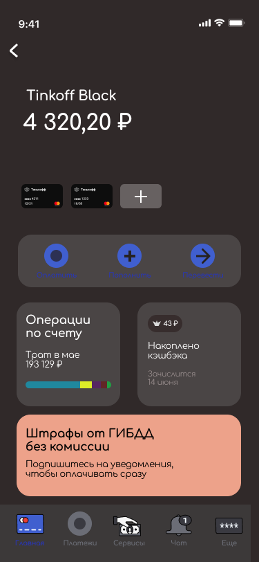
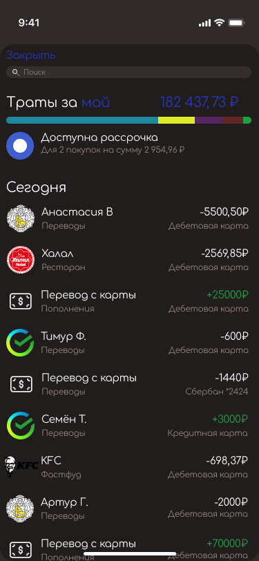

# Итогова работа "Прототипирование интерфейсов" 

## Задание №1

Используйте видео-инструкции по созданию экрана банковского приложения:
- “Рисуем экран продукта банковского приложения. Часть 1”
- “Рисуем экран продукта банковского приложения. Часть 2”

Создайте в Figma прототип главного экрана приложения для учёта трат для iOS.

Ссылку на выполненное задание в Figma загрузите в свой личный кабинет.

**Результат:**

Получите практические знания и создадите в Figma прототип главного экрана приложения для учёта трат для iOS.

### Прототип главного экрана приложения для учета трат для IOS

## Задание №2

Для выполнения домашнего задания выберите любой из двух вариантов.

1. Задание (базовый вариант): это задание подходит для новичков.
Переработайте прототип главного экрана приложения для учёта трат под Android.

2. *Задание (продвинутый вариант): если вы знакомы с Figma, то выполните задание со звёздочкой.
 - Доработайте экран приложения для учёта трат, сделав кликабельный прототип.
 - Используйте видео-инструкцию “Прототипирование”
 
 [Решение задания со звездочкой в Figma](https://www.figma.com/file/BxSUVH9nDHpQsodNCt2d3p/%D0%94%D0%B7-%E2%84%961?node-id=0%3A1)
